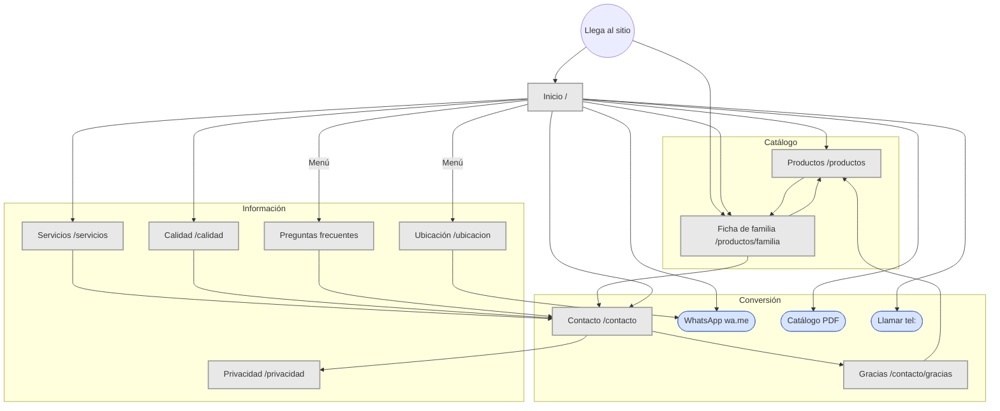

# Mapa de pantallas

Todas las pantallas y la navegación general. Rutas reales (ADR 0002). Cabecera, WhatsApp flotante y pie están en todas las páginas; no se dibujan en cada flecha.

```mermaid
graph TD
    Entry((Llega al sitio)) --> Home["Inicio /"]
    Entry --> Fam
    subgraph Catalogo["Catálogo"]
        Prod["Productos /productos"]
        Fam["Ficha de familia /productos/familia"]
    end
    subgraph Info["Información"]
        Serv["Servicios /servicios"]
        Cal["Calidad /calidad"]
        Faq["Preguntas frecuentes"]
        Ubi["Ubicación /ubicacion"]
        Priv["Privacidad /privacidad"]
    end
    subgraph Conv["Conversión"]
        Cont["Contacto /contacto"]
        Gra["Gracias /contacto/gracias"]
        WA(["WhatsApp wa.me"])
        PDF(["Catálogo PDF"])
        Tel(["Llamar tel:"])
    end
    Home --> Prod
    Home --> Fam
    Home --> Serv
    Home --> Cal
    Prod --> Fam
    Fam --> Prod
    Fam --> Cont
    Serv --> Cont
    Cal --> Cont
    Faq --> Cont
    Ubi --> WA
    Cont --> Gra
    Gra --> Prod
    Home -->|"Menú"| Faq
    Home -->|"Menú"| Ubi
    Home --> Cont
    Home --> PDF
    Home --> WA
    Home --> Tel
    Cont --> Priv

    classDef screen fill:#e8e8e8,stroke:#999,stroke-width:2px
    classDef decision fill:#fff3cd,stroke:#ffc107,stroke-width:2px
    classDef action fill:#d4edda,stroke:#28a745,stroke-width:1px
    classDef ext fill:#d6e4ff,stroke:#4a6fd0,stroke-width:1px
    class Home,Prod,Fam,Serv,Cal,Faq,Ubi,Priv,Cont,Gra screen
    class WA,PDF,Tel ext
```
