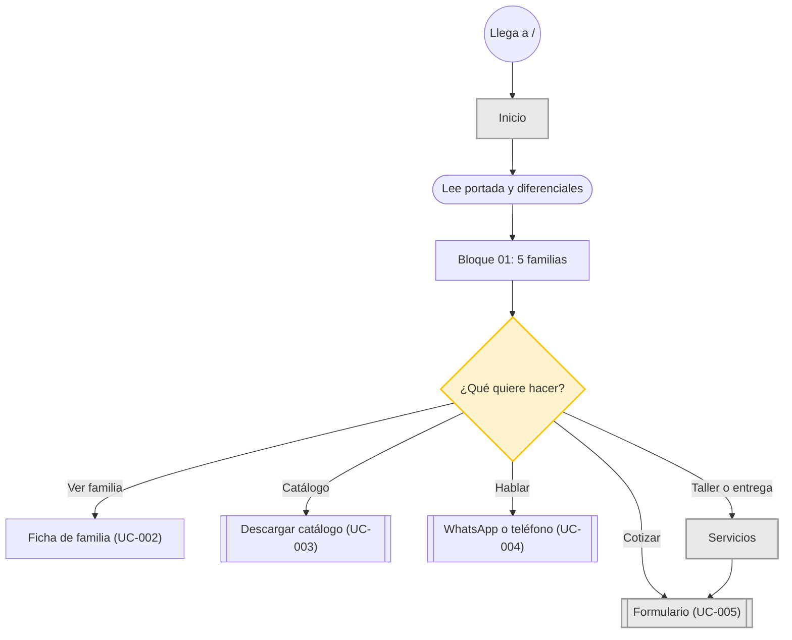

# UC-001 — Entender qué vende — flujo

Navegación entre pantallas y decisiones.

```mermaid
graph TD
    Start(("Llega a /")) --> Home["Inicio"]
    Home --> Portada([Lee portada y diferenciales])
    Portada --> Familias["Bloque 01: 5 familias"]
    Familias --> Choice{"¿Qué quiere hacer?"}
    Choice -->|Ver familia| Fam["Ficha de familia (UC-002)"]
    Choice -->|Catálogo| PDF[["Descargar catálogo (UC-003)"]]
    Choice -->|Hablar| WA[["WhatsApp o teléfono (UC-004)"]]
    Choice -->|Taller o entrega| Serv["Servicios"]
    Choice -->|Cotizar| Cont[["Formulario (UC-005)"]]
    Serv --> Cont

    classDef screen fill:#e8e8e8,stroke:#999,stroke-width:2px
    classDef decision fill:#fff3cd,stroke:#ffc107,stroke-width:2px
    classDef action fill:#d4edda,stroke:#28a745,stroke-width:1px
    classDef ext fill:#d6e4ff,stroke:#4a6fd0,stroke-width:1px
    class Home,Serv,Cont screen
    class Choice decision
```
