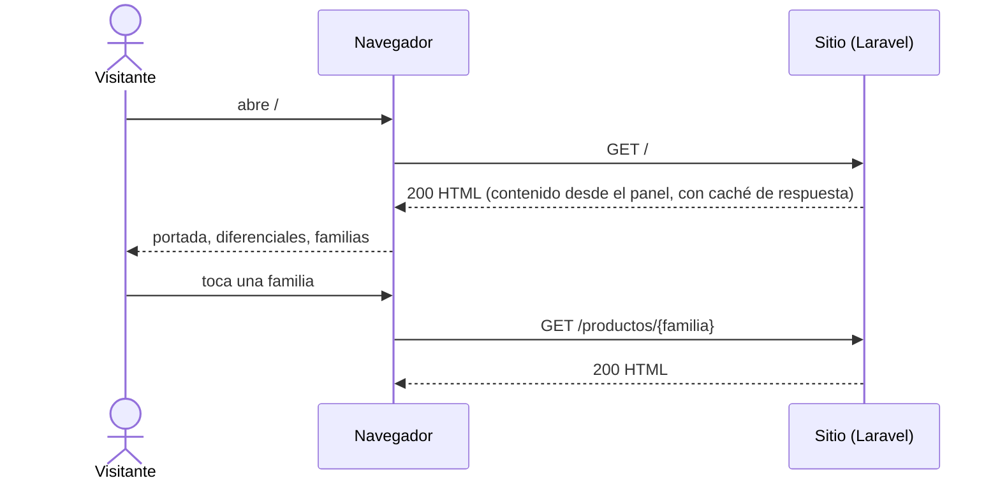

# UC-001 — Entender qué vende — secuencia

Interacción navegador y servidor.

```mermaid
sequenceDiagram
    actor V as Visitante
    participant N as Navegador
    participant S as Sitio (Laravel)
    V->>N: abre /
    N->>S: GET /
    S-->>N: 200 HTML (contenido desde el panel, con caché de respuesta)
    N-->>V: portada, diferenciales, familias
    V->>N: toca una familia
    N->>S: GET /productos/{familia}
    S-->>N: 200 HTML
```
