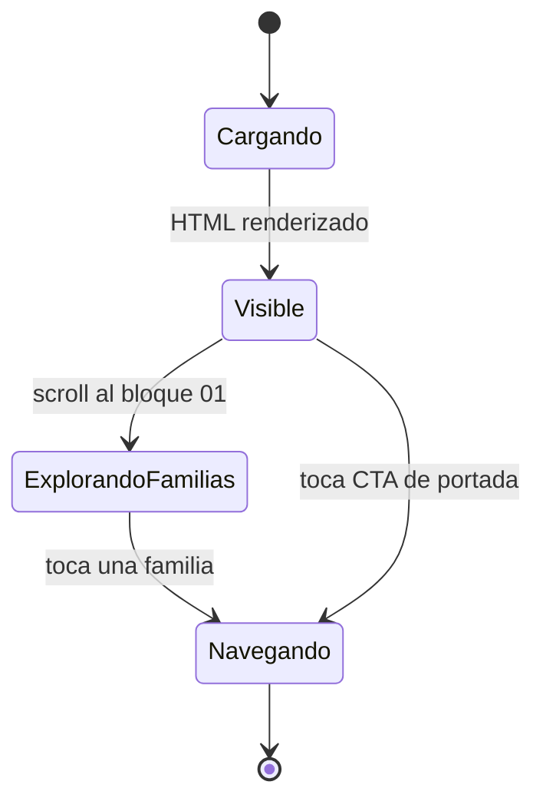

# UC-001 — Entender qué vende — estados

Estados de la interfaz.

```mermaid
stateDiagram-v2
    [*] --> Cargando
    Cargando --> Visible: HTML renderizado
    Visible --> ExplorandoFamilias: scroll al bloque 01
    ExplorandoFamilias --> Navegando: toca una familia
    Visible --> Navegando: toca CTA de portada
    Navegando --> [*]
```
