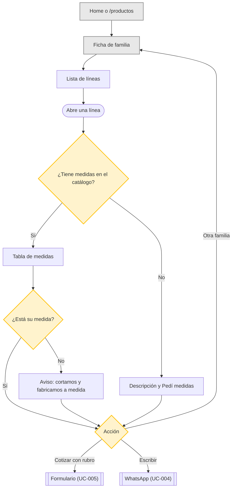

# UC-002 — Ver una familia y sus medidas — flujo

Navegación entre pantallas y decisiones.

```mermaid
graph TD
    Origen["Home o /productos"] --> Fam["Ficha de familia"]
    Fam --> Lineas["Lista de líneas"]
    Lineas --> Abre([Abre una línea])
    Abre --> Med{"¿Tiene medidas en el catálogo?"}
    Med -->|Sí| Tabla["Tabla de medidas"]
    Med -->|No| SinMed["Descripción y Pedí medidas"]
    Tabla --> Otra{"¿Está su medida?"}
    Otra -->|No| ACMedida["Aviso: cortamos y fabricamos a medida"]
    Otra -->|Sí| Acc{"Acción"}
    ACMedida --> Acc
    SinMed --> Acc
    Acc -->|Cotizar con rubro| Cont[["Formulario (UC-005)"]]
    Acc -->|Escribir| WA[["WhatsApp (UC-004)"]]
    Acc -->|Otra familia| Fam

    classDef screen fill:#e8e8e8,stroke:#999,stroke-width:2px
    classDef decision fill:#fff3cd,stroke:#ffc107,stroke-width:2px
    classDef action fill:#d4edda,stroke:#28a745,stroke-width:1px
    classDef ext fill:#d6e4ff,stroke:#4a6fd0,stroke-width:1px
    class Fam,Origen screen
    class Med,Otra,Acc decision
```
