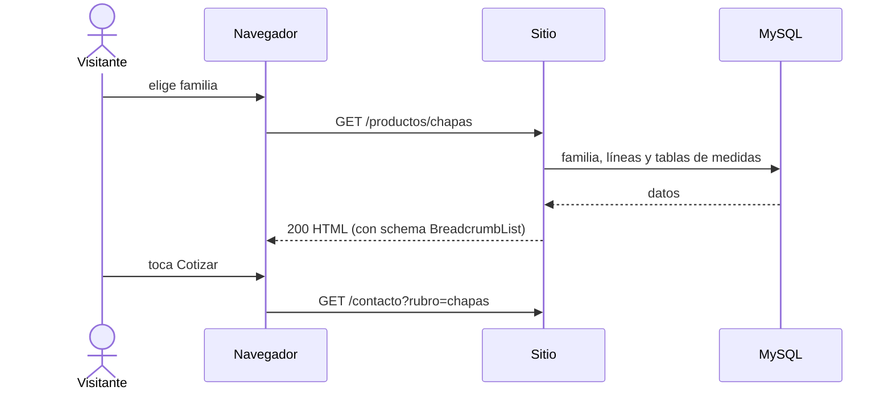

# UC-002 — Ver una familia y sus medidas — secuencia

Interacción navegador y servidor.

```mermaid
sequenceDiagram
    actor V as Visitante
    participant N as Navegador
    participant S as Sitio
    participant DB as MySQL
    V->>N: elige familia
    N->>S: GET /productos/chapas
    S->>DB: familia, líneas y tablas de medidas
    DB-->>S: datos
    S-->>N: 200 HTML (con schema BreadcrumbList)
    V->>N: toca Cotizar
    N->>S: GET /contacto?rubro=chapas
```
