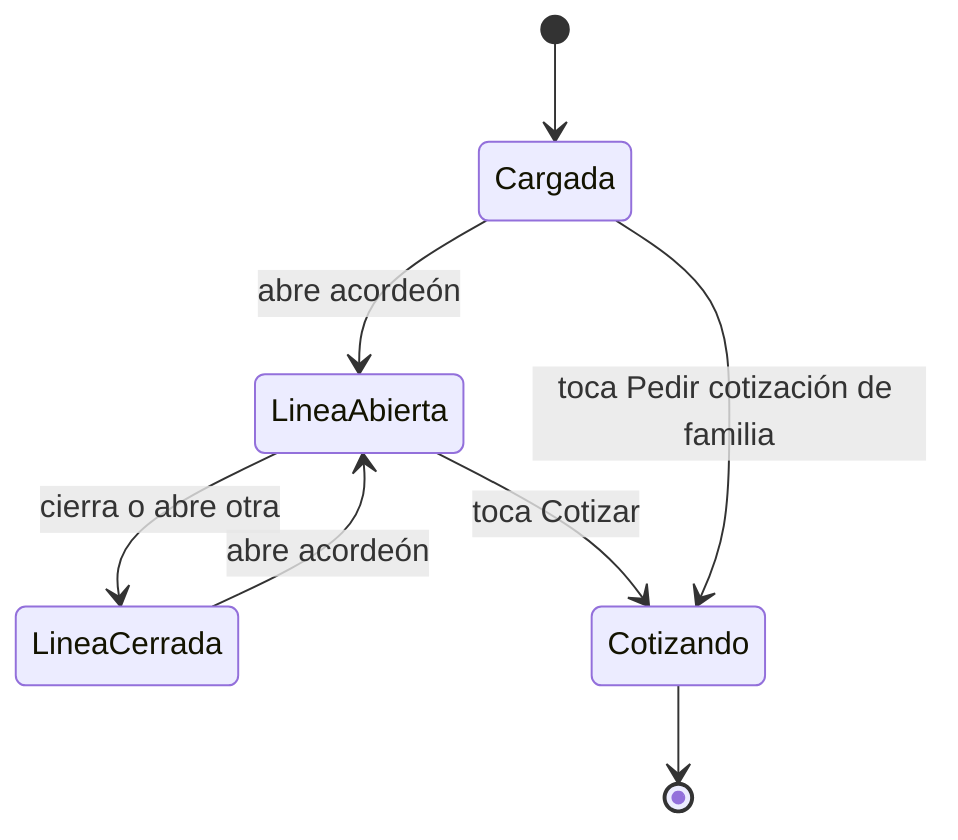

# UC-002 — Ver una familia y sus medidas — estados

Estados de la interfaz.

```mermaid
stateDiagram-v2
    [*] --> Cargada
    Cargada --> LineaAbierta: abre acordeón
    LineaAbierta --> LineaCerrada: cierra o abre otra
    LineaCerrada --> LineaAbierta: abre acordeón
    LineaAbierta --> Cotizando: toca Cotizar
    Cargada --> Cotizando: toca Pedir cotización de familia
    Cotizando --> [*]
```
