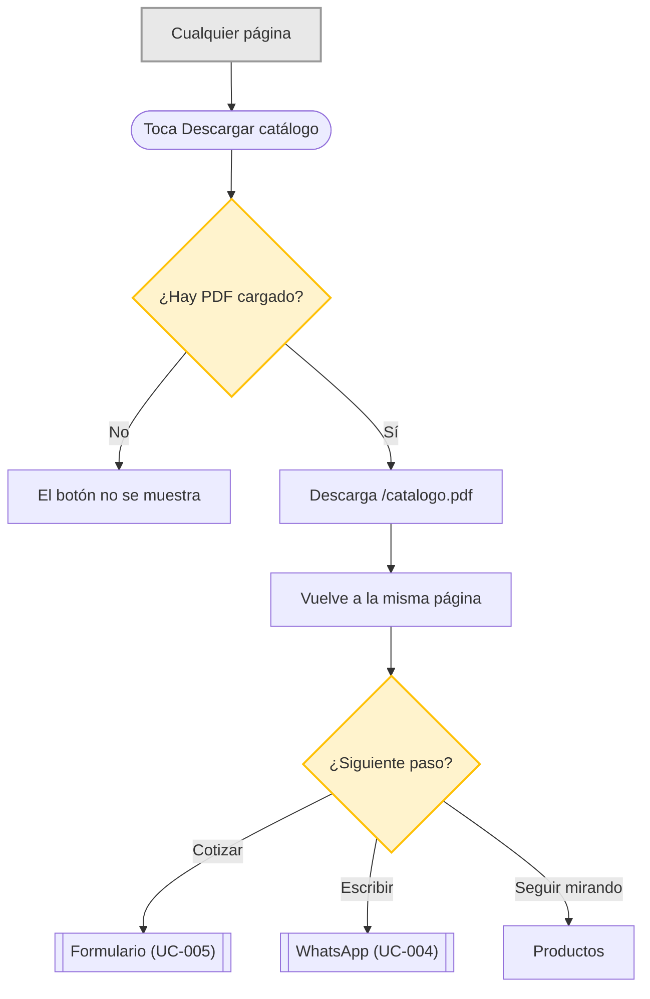

# UC-003 — Acceder al catálogo PDF — flujo

Navegación entre pantallas y decisiones.

```mermaid
graph TD
    Cualquiera["Cualquier página"] --> Btn([Toca Descargar catálogo])
    Btn --> Hay{"¿Hay PDF cargado?"}
    Hay -->|No| Oculto["El botón no se muestra"]
    Hay -->|Sí| Desc["Descarga /catalogo.pdf"]
    Desc --> Vuelve["Vuelve a la misma página"]
    Vuelve --> Sig{"¿Siguiente paso?"}
    Sig -->|Cotizar| Cont[["Formulario (UC-005)"]]
    Sig -->|Escribir| WA[["WhatsApp (UC-004)"]]
    Sig -->|Seguir mirando| Prod["Productos"]

    classDef screen fill:#e8e8e8,stroke:#999,stroke-width:2px
    classDef decision fill:#fff3cd,stroke:#ffc107,stroke-width:2px
    classDef action fill:#d4edda,stroke:#28a745,stroke-width:1px
    classDef ext fill:#d6e4ff,stroke:#4a6fd0,stroke-width:1px
    class Cualquiera screen
    class Hay,Sig decision
```
