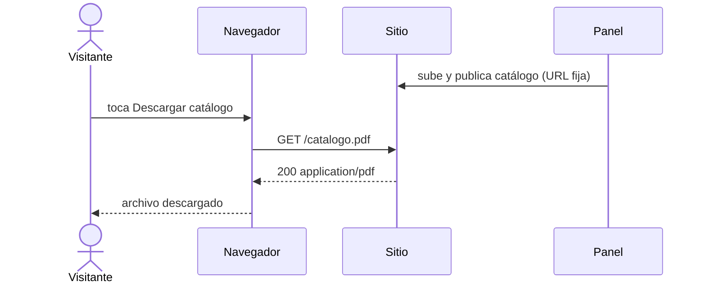

# UC-003 — Acceder al catálogo PDF — secuencia

Interacción navegador y servidor.

```mermaid
sequenceDiagram
    actor V as Visitante
    participant N as Navegador
    participant S as Sitio
    participant P as Panel
    P->>S: sube y publica catálogo (URL fija)
    V->>N: toca Descargar catálogo
    N->>S: GET /catalogo.pdf
    S-->>N: 200 application/pdf
    N-->>V: archivo descargado
```
