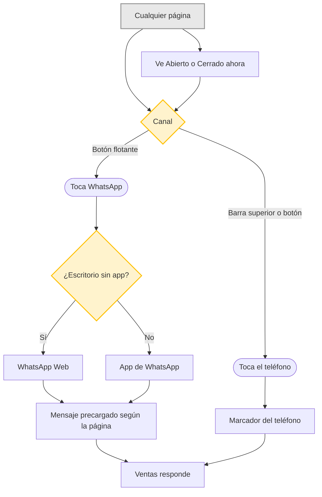

# UC-004 — Hablar con ventas — flujo

Navegación entre pantallas y decisiones.

```mermaid
graph TD
    Cualquiera["Cualquier página"] --> Elige{"Canal"}
    Elige -->|Botón flotante| WA([Toca WhatsApp])
    Elige -->|Barra superior o botón| Tel([Toca el teléfono])
    WA --> Dev{"¿Escritorio sin app?"}
    Dev -->|Sí| Web["WhatsApp Web"]
    Dev -->|No| App["App de WhatsApp"]
    Web --> Msg["Mensaje precargado según la página"]
    App --> Msg
    Msg --> Ventas["Ventas responde"]
    Tel --> Llama["Marcador del teléfono"]
    Llama --> Ventas
    Cualquiera --> Hora["Ve Abierto o Cerrado ahora"]
    Hora --> Elige

    classDef screen fill:#e8e8e8,stroke:#999,stroke-width:2px
    classDef decision fill:#fff3cd,stroke:#ffc107,stroke-width:2px
    classDef action fill:#d4edda,stroke:#28a745,stroke-width:1px
    classDef ext fill:#d6e4ff,stroke:#4a6fd0,stroke-width:1px
    class Cualquiera screen
    class Elige,Dev decision
```
