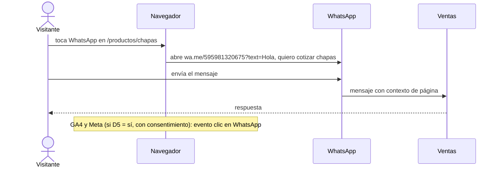

# UC-004 — Hablar con ventas — secuencia

Interacción navegador y servidor.

```mermaid
sequenceDiagram
    actor V as Visitante
    participant N as Navegador
    participant W as WhatsApp
    participant VT as Ventas
    V->>N: toca WhatsApp en /productos/chapas
    N->>W: abre wa.me/595981320675?text=Hola, quiero cotizar chapas
    V->>W: envía el mensaje
    W->>VT: mensaje con contexto de página
    VT-->>V: respuesta
    Note over N: GA4 y Meta (si D5 = sí, con consentimiento): evento clic en WhatsApp
```
