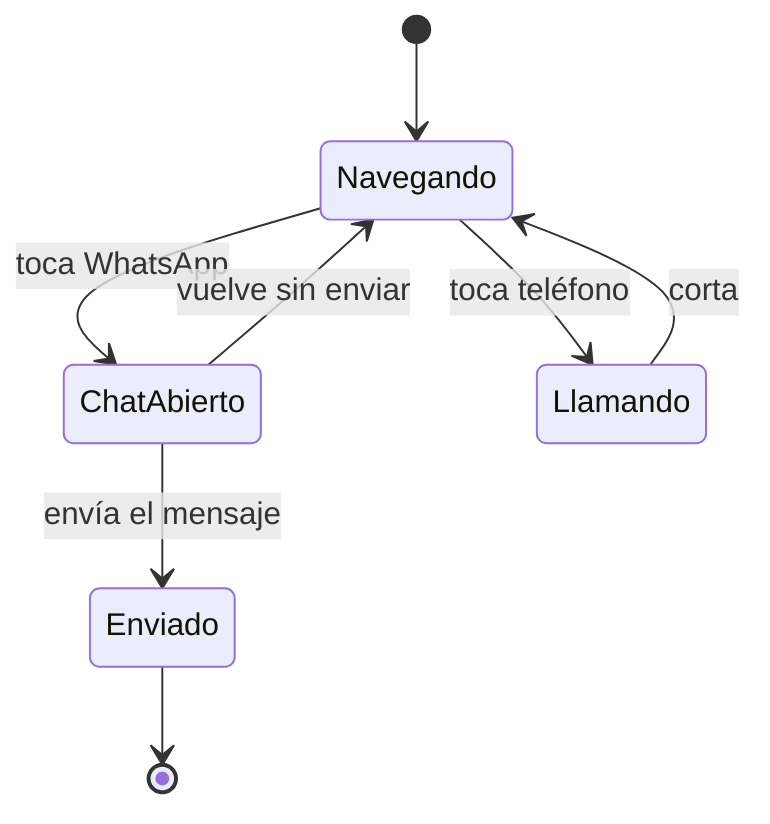

# UC-004 — Hablar con ventas — estados

Estados de la interfaz.

```mermaid
stateDiagram-v2
    [*] --> Navegando
    Navegando --> ChatAbierto: toca WhatsApp
    Navegando --> Llamando: toca teléfono
    ChatAbierto --> Enviado: envía el mensaje
    ChatAbierto --> Navegando: vuelve sin enviar
    Llamando --> Navegando: corta
    Enviado --> [*]
```
