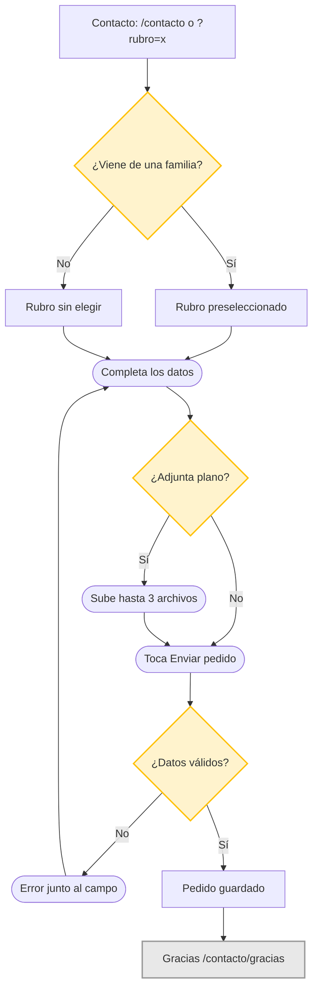

# UC-005 — Pedir cotización con el formulario — flujo

Navegación entre pantallas y decisiones.

```mermaid
graph TD
    Entra["Contacto: /contacto o ?rubro=x"] --> Rubro{"¿Viene de una familia?"}
    Rubro -->|Sí| Pre["Rubro preseleccionado"]
    Rubro -->|No| Vacio["Rubro sin elegir"]
    Pre --> Llena([Completa los datos])
    Vacio --> Llena
    Llena --> Adj{"¿Adjunta plano?"}
    Adj -->|Sí| Files([Sube hasta 3 archivos])
    Adj -->|No| Env([Toca Enviar pedido])
    Files --> Env
    Env --> Val{"¿Datos válidos?"}
    Val -->|No| Err([Error junto al campo])
    Err --> Llena
    Val -->|Sí| Guarda["Pedido guardado"]
    Guarda --> Gra["Gracias /contacto/gracias"]

    classDef screen fill:#e8e8e8,stroke:#999,stroke-width:2px
    classDef decision fill:#fff3cd,stroke:#ffc107,stroke-width:2px
    classDef action fill:#d4edda,stroke:#28a745,stroke-width:1px
    classDef ext fill:#d6e4ff,stroke:#4a6fd0,stroke-width:1px
    class Gra screen
    class Rubro,Adj,Val decision
```
