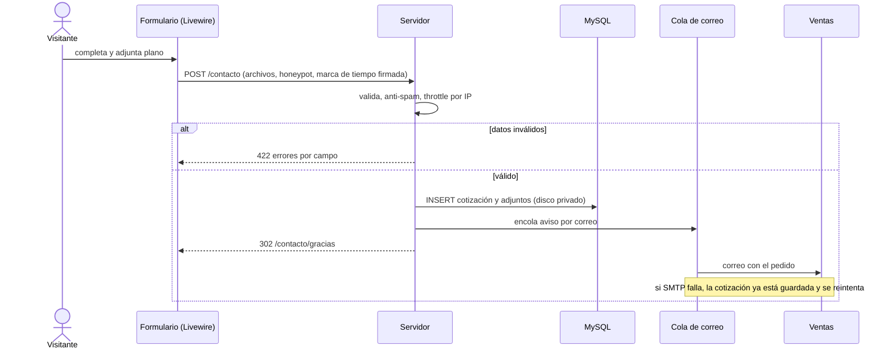

# UC-005 — Pedir cotización con el formulario — secuencia

Interacción navegador y servidor.

```mermaid
sequenceDiagram
    actor V as Visitante
    participant F as Formulario (Livewire)
    participant S as Servidor
    participant DB as MySQL
    participant Q as Cola de correo
    participant VT as Ventas
    V->>F: completa y adjunta plano
    F->>S: POST /contacto (archivos, honeypot, marca de tiempo firmada)
    S->>S: valida, anti-spam, throttle por IP
    alt datos inválidos
        S-->>F: 422 errores por campo
    else válido
        S->>DB: INSERT cotización y adjuntos (disco privado)
        S->>Q: encola aviso por correo
        S-->>F: 302 /contacto/gracias
        Q->>VT: correo con el pedido
        Note over Q,VT: si SMTP falla, la cotización ya está guardada y se reintenta
    end
```
