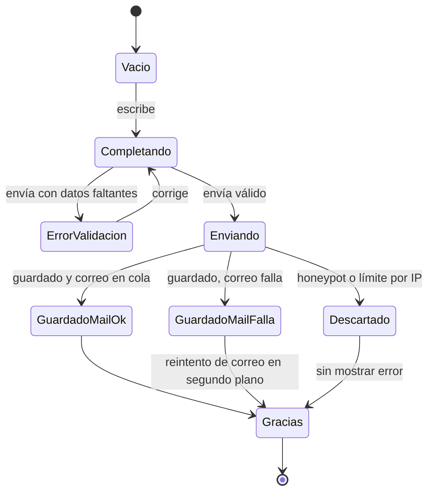

# UC-005 — Pedir cotización con el formulario — estados

Estados de la interfaz.

```mermaid
stateDiagram-v2
    [*] --> Vacio
    Vacio --> Completando: escribe
    Completando --> ErrorValidacion: envía con datos faltantes
    ErrorValidacion --> Completando: corrige
    Completando --> Enviando: envía válido
    Enviando --> GuardadoMailOk: guardado y correo en cola
    Enviando --> GuardadoMailFalla: guardado, correo falla
    Enviando --> Descartado: honeypot o límite por IP
    GuardadoMailOk --> Gracias
    GuardadoMailFalla --> Gracias: reintento de correo en segundo plano
    Descartado --> Gracias: sin mostrar error
    Gracias --> [*]
```
