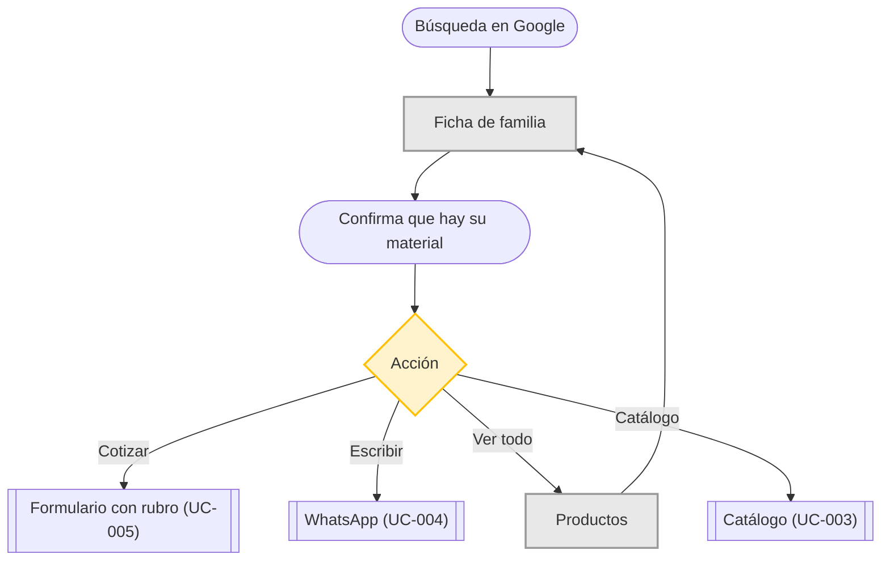

# UC-006 — Llegar desde Google a un producto y cotizar — flujo

Navegación entre pantallas y decisiones.

```mermaid
graph TD
    G(["Búsqueda en Google"]) --> Fam["Ficha de familia"]
    Fam --> Ve([Confirma que hay su material])
    Ve --> Acc{"Acción"}
    Acc -->|Cotizar| Cont[["Formulario con rubro (UC-005)"]]
    Acc -->|Escribir| WA[["WhatsApp (UC-004)"]]
    Acc -->|Ver todo| Prod["Productos"]
    Acc -->|Catálogo| PDF[["Catálogo (UC-003)"]]
    Prod --> Fam

    classDef screen fill:#e8e8e8,stroke:#999,stroke-width:2px
    classDef decision fill:#fff3cd,stroke:#ffc107,stroke-width:2px
    classDef action fill:#d4edda,stroke:#28a745,stroke-width:1px
    classDef ext fill:#d6e4ff,stroke:#4a6fd0,stroke-width:1px
    class Prod,Fam screen
    class Acc decision
```
