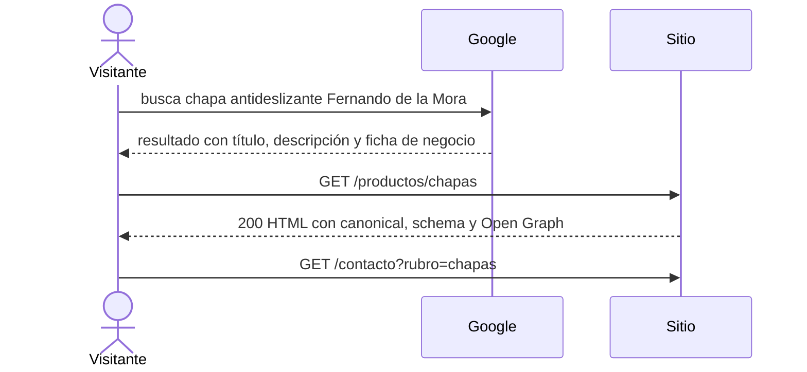

# UC-006 — Llegar desde Google a un producto y cotizar — secuencia

Interacción navegador y servidor.

```mermaid
sequenceDiagram
    actor V as Visitante
    participant G as Google
    participant S as Sitio
    V->>G: busca chapa antideslizante Fernando de la Mora
    G-->>V: resultado con título, descripción y ficha de negocio
    V->>S: GET /productos/chapas
    S-->>V: 200 HTML con canonical, schema y Open Graph
    V->>S: GET /contacto?rubro=chapas
```
