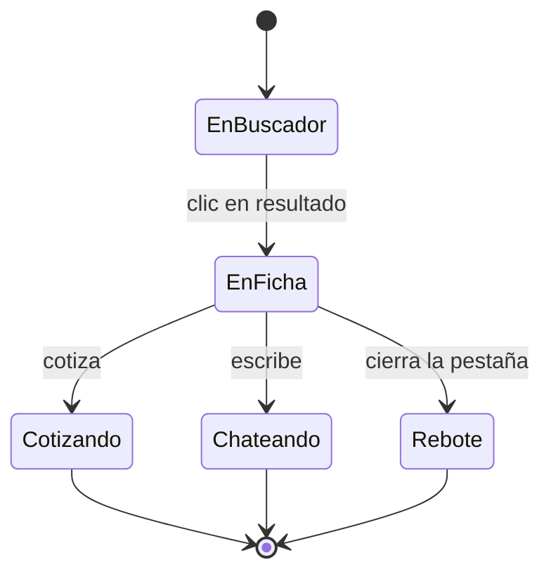

# UC-006 — Llegar desde Google a un producto y cotizar — estados

Estados de la interfaz.

```mermaid
stateDiagram-v2
    [*] --> EnBuscador
    EnBuscador --> EnFicha: clic en resultado
    EnFicha --> Cotizando: cotiza
    EnFicha --> Chateando: escribe
    EnFicha --> Rebote: cierra la pestaña
    Cotizando --> [*]
    Chateando --> [*]
    Rebote --> [*]
```
