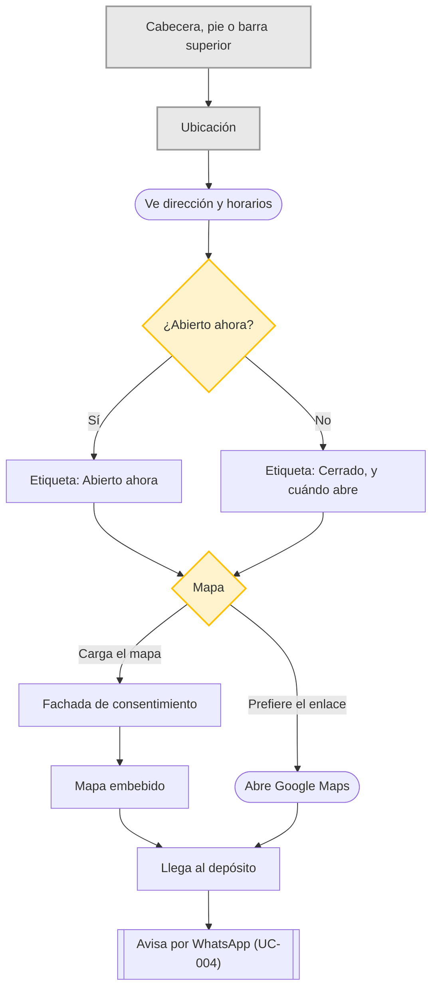

# UC-007 — Saber cómo llegar y cuándo está abierto — flujo

Navegación entre pantallas y decisiones.

```mermaid
graph TD
    Menu["Cabecera, pie o barra superior"] --> Ubi["Ubicación"]
    Ubi --> Datos([Ve dirección y horarios])
    Datos --> Estado{"¿Abierto ahora?"}
    Estado -->|Sí| Abierto["Etiqueta: Abierto ahora"]
    Estado -->|No| Cerrado["Etiqueta: Cerrado, y cuándo abre"]
    Abierto --> Mapa{"Mapa"}
    Cerrado --> Mapa
    Mapa -->|Carga el mapa| Cons["Fachada de consentimiento"]
    Mapa -->|Prefiere el enlace| Maps(["Abre Google Maps"])
    Cons --> Embed["Mapa embebido"]
    Embed --> Fin["Llega al depósito"]
    Maps --> Fin
    Fin --> WA[["Avisa por WhatsApp (UC-004)"]]

    classDef screen fill:#e8e8e8,stroke:#999,stroke-width:2px
    classDef decision fill:#fff3cd,stroke:#ffc107,stroke-width:2px
    classDef action fill:#d4edda,stroke:#28a745,stroke-width:1px
    classDef ext fill:#d6e4ff,stroke:#4a6fd0,stroke-width:1px
    class Ubi,Menu screen
    class Estado,Mapa decision
```
