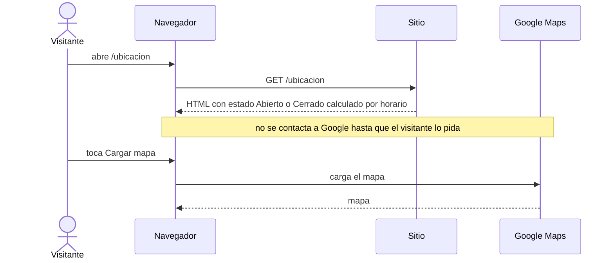

# UC-007 — Saber cómo llegar y cuándo está abierto — secuencia

Interacción navegador y servidor.

```mermaid
sequenceDiagram
    actor V as Visitante
    participant N as Navegador
    participant S as Sitio
    participant GM as Google Maps
    V->>N: abre /ubicacion
    N->>S: GET /ubicacion
    S-->>N: HTML con estado Abierto o Cerrado calculado por horario
    Note over N,GM: no se contacta a Google hasta que el visitante lo pida
    V->>N: toca Cargar mapa
    N->>GM: carga el mapa
    GM-->>N: mapa
```
