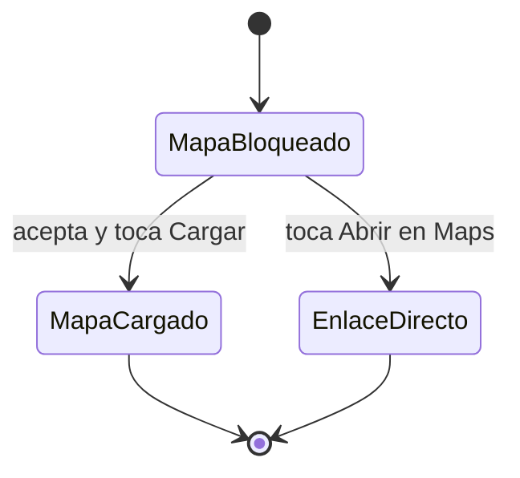

# UC-007 — Saber cómo llegar y cuándo está abierto — estados

Estados de la interfaz.

```mermaid
stateDiagram-v2
    [*] --> MapaBloqueado
    MapaBloqueado --> MapaCargado: acepta y toca Cargar
    MapaBloqueado --> EnlaceDirecto: toca Abrir en Maps
    MapaCargado --> [*]
    EnlaceDirecto --> [*]
```
