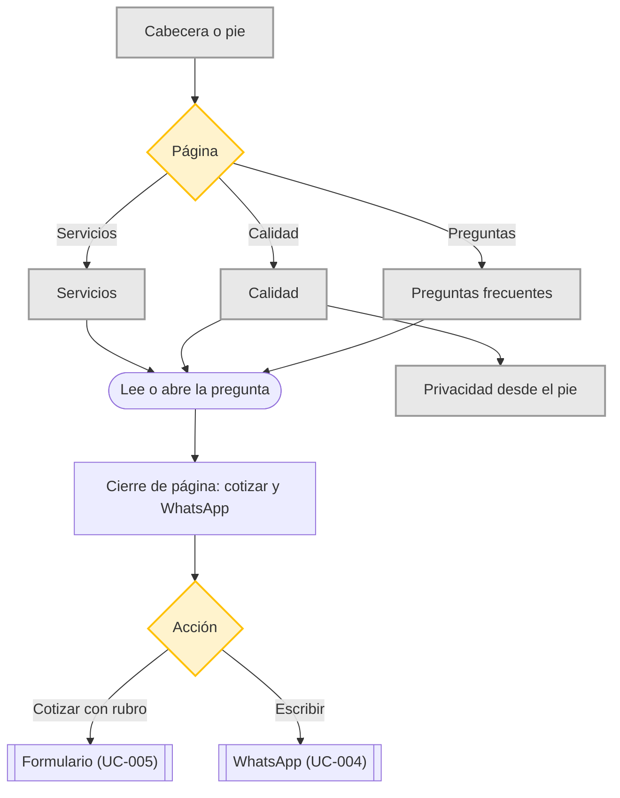

# UC-008 — Conocer servicios, calidad y resolver dudas — flujo

Navegación entre pantallas y decisiones.

```mermaid
graph TD
    Menu["Cabecera o pie"] --> P{"Página"}
    P -->|Servicios| Serv["Servicios"]
    P -->|Calidad| Cal["Calidad"]
    P -->|Preguntas| Faq["Preguntas frecuentes"]
    Serv --> Lee([Lee o abre la pregunta])
    Cal --> Lee
    Faq --> Lee
    Lee --> Cierre["Cierre de página: cotizar y WhatsApp"]
    Cierre --> Acc{"Acción"}
    Acc -->|Cotizar con rubro| Cont[["Formulario (UC-005)"]]
    Acc -->|Escribir| WA[["WhatsApp (UC-004)"]]
    Cal --> Priv["Privacidad desde el pie"]

    classDef screen fill:#e8e8e8,stroke:#999,stroke-width:2px
    classDef decision fill:#fff3cd,stroke:#ffc107,stroke-width:2px
    classDef action fill:#d4edda,stroke:#28a745,stroke-width:1px
    classDef ext fill:#d6e4ff,stroke:#4a6fd0,stroke-width:1px
    class Serv,Cal,Faq,Priv,Menu screen
    class Acc,P decision
```
