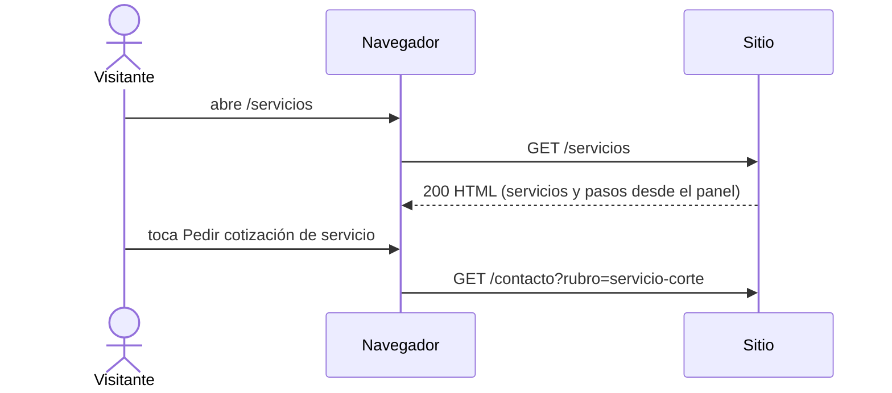

# UC-008 — Conocer servicios, calidad y resolver dudas — secuencia

Interacción navegador y servidor.

```mermaid
sequenceDiagram
    actor V as Visitante
    participant N as Navegador
    participant S as Sitio
    V->>N: abre /servicios
    N->>S: GET /servicios
    S-->>N: 200 HTML (servicios y pasos desde el panel)
    V->>N: toca Pedir cotización de servicio
    N->>S: GET /contacto?rubro=servicio-corte
```
