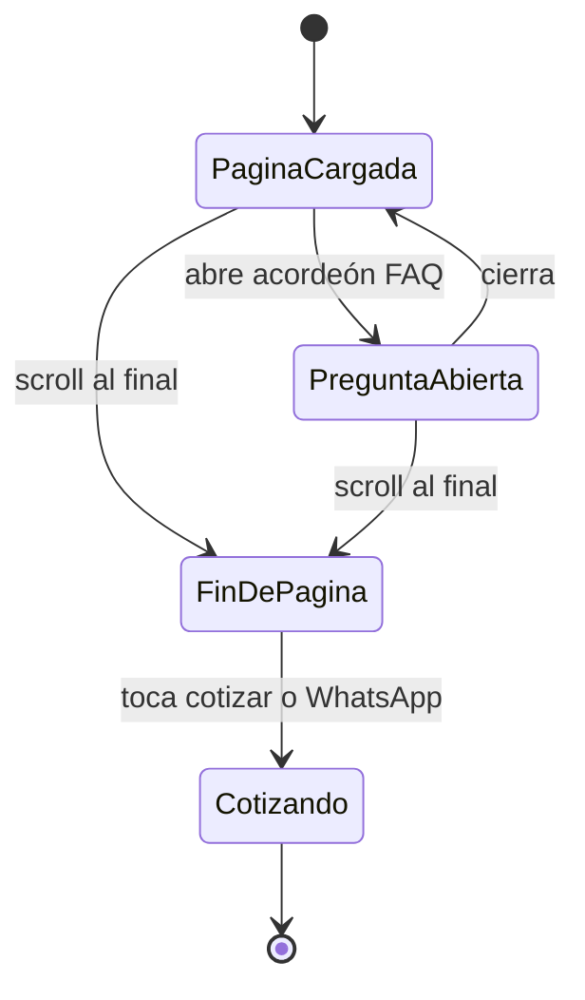

# UC-008 — Conocer servicios, calidad y resolver dudas — estados

Estados de la interfaz.

```mermaid
stateDiagram-v2
    [*] --> PaginaCargada
    PaginaCargada --> PreguntaAbierta: abre acordeón FAQ
    PreguntaAbierta --> PaginaCargada: cierra
    PaginaCargada --> FinDePagina: scroll al final
    PreguntaAbierta --> FinDePagina: scroll al final
    FinDePagina --> Cotizando: toca cotizar o WhatsApp
    Cotizando --> [*]
```
